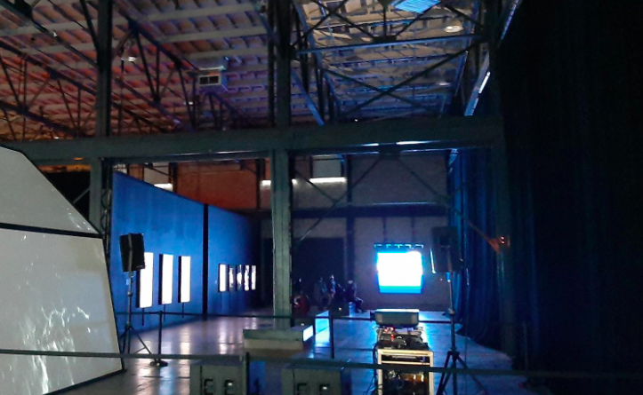
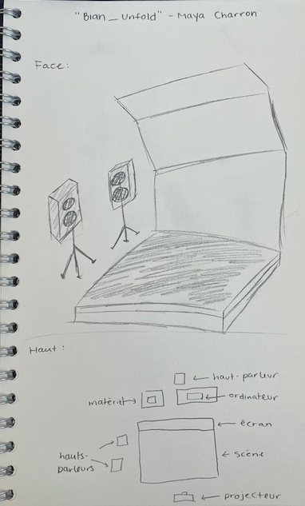
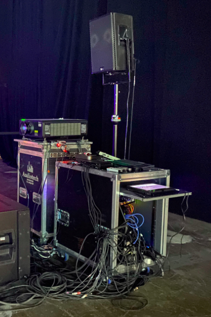
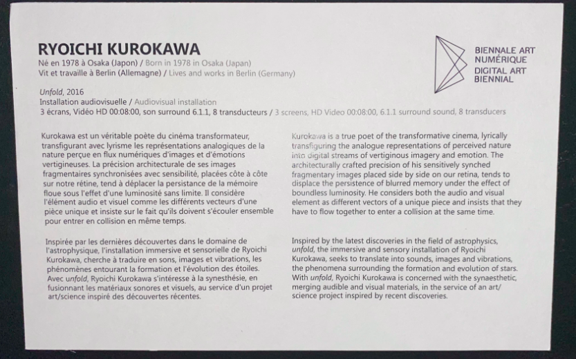

# Titre: 
Unfold
 
 
# Artiste: 
Ryoichi Kurokawa

# Année de réalisation: 
2016

# Nom de l'exposition:
Metamorphosis

# Lieu de l'exposition:
Arsenal

# Date de visite:
9 Février 2022

# Description de l'oeuvre:
L'auteur de cette oeuvre tente de nous transmettre diverses sensations à travers la vue, l'ouîe et le toucher. Kurokawa traduit le phénomène de la formation des étoiles en forme de synestésie afin que celui-ci soit perceptible à l'humain.

# Explication sur la mise en espace:
L'oeuvre inclu une caisse de bois servant de scène oû l'intéracteur peut se placer. Face à cette petite scène, se trouve un grand écran blanc plié de sorte à se qu'il offre différents angles de vue au spéctateur. Par la suite, deux hauts-parleurs se trouvent de chaques côtés de la petite scène. 

# Composantes techniques:
Derrière le grand écran blanc, se trouve les ordinateurs qui permettent de projeter les images sur ce dernier.

# Expérience vécue:
J'ai beaucoup aimée comment les sons étaient en harmonie avec les images qui elles aussi étaient en coordination avec les vibrations ressenties sur le scène en bois. Les images projetées sur l'écran blanc me fascinaient tellement elles étaient magnifiques. Enfin, j'adore le fait que le créateur de ce projet tente d'illustrer des formations célestes, car tout ce qui se trouve dans l'espace nous semble tellement innateignable qu'il nous est compliquer de les imaginer.

# Commentaires d'amélioration:
À certains moments durant l'exposition, je me sentais extrêmement envahie et hyperstimulé par cette combinaisons de sensations. Malgré le fait que cela faisait probablement partie de l'oeuvre, je ne pouvait m'empêcher d'avoir la nausée après avoir regardé celle-ci.

# Source:

