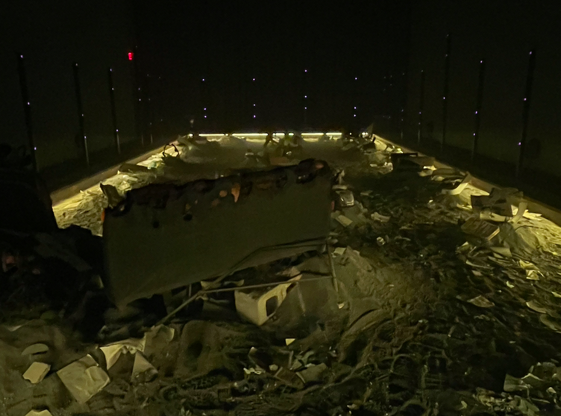

# Titre: 
Ciel à Outrances / Lashing Skies
 
# Artiste: 
Brigitte Poupart et Madeleine Monette

# Année de réalisation: 
Inconnue

# Nom de l'exposition:
Ciel à Outrances / Lashing Skies

# Lieu de l'exposition:
Centre PHI

# Date de visite:
17 Mars 2022

# Description de l'oeuvre:
Cette exposition est un voyage audio-intéractif qui a pour but de nous mettre dans la peau de personnes vivant leurs vie quotidienne durant les évènements du 11 Septembre 2001. Que faisait-tu ce matin-là? Où était-tu cette journée là? À travers 5 poèmes, nous suivons la vie de 5 personnes ayant vécu l'expérience différemment.

# Explication sur la mise en espace:
L'exposition consistait d'une pièce sombre et vaste. Le sol, qui était recouvert de sable et de cendres, entourait divers objets, la plupart abimés. Une affiche Taxi, une vielle poupée, un lit, des canettes de bières et bien d'autres.

# Composantes techniques:
Afin de vivre l'expérience, il était nécéssaire de porter un casque afin d'entendre les poèmes. À l'intérieur des divers objets qui recouvraient le sol, il y avait des lumières rouges qui permettait de guider l'intéracteur à travers les poèmes.

# Expérience vécue:
J'ai beaucoup aimée l'expérience Ciel à Outances car elle permettait d'illustrer les diférents points de vues que partagent différentes personnes sur un même drame. Cependant, j'étais un peu déçue de ne pas pouvoir comprendre ce que ces personnages ressentaient puisque je n'étais pas née durant les faits. C'est porquoi je suis contente d'avoir pu participer à cette expérience; j'ai pu percevoir d'un point de vue plus rapprocher cet évènement tragique et ainsi réellement assimilé l'empleur des conséquences que celui-ci à eu sur une génération.

# Commentaires d'amélioration:
J'ai trouver l'expérience plutôt longue puisqu'elle durait 45 minutes et que nous passions ces minutes debout. De plus, je tenais à m'excuser pour le manque de photos, la dame qui nous faisaient visiter semblait peu réticente à l'idée.

# Source:

https://phi.ca/en/events/lashing-skies/
